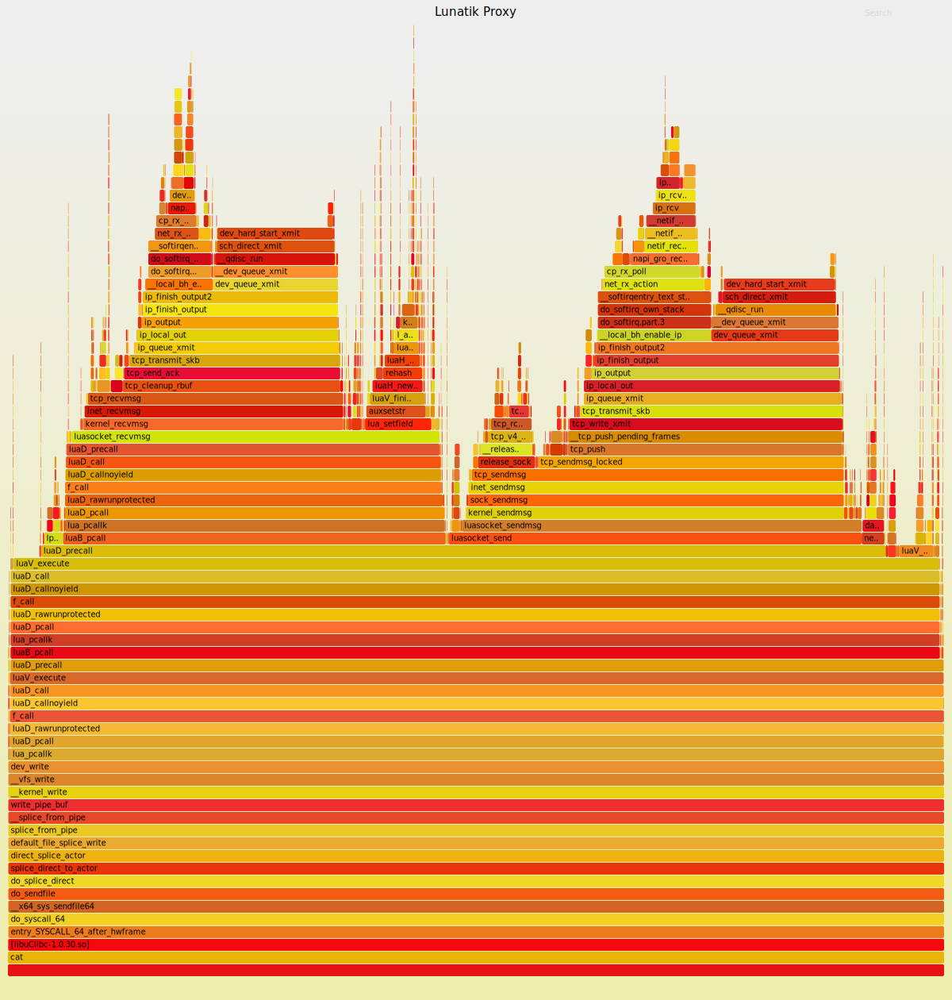

# Lunatik Socket Library Documention

<!-- TOC -->

- [Lunatik Socket Library Documention](#lunatik-socket-library-documention)
    - [Introduction](#introduction)
        - [Compile](#compile)
    - [SOCKSv4 Demo](#socksv4-demo)
    - [Benchmark](#benchmark)
        - [Environment](#environment)
        - [Method](#method)
        - [Result](#result)
        - [Flame Graph](#flame-graph)
    - [Socket API](#socket-api)
        - [`socket.new()`](#socketnew)
            - [Syntax](#syntax)
            - [Parameters](#parameters)
            - [Returns](#returns)
            - [Example](#example)
        - [`socket:bind()`](#socketbind)
            - [Syntax](#syntax-1)
            - [Parameters](#parameters-1)
            - [Returns](#returns-1)
            - [Example](#example-1)
        - [`socket:listen()`](#socketlisten)
            - [Syntax](#syntax-2)
            - [Parameters](#parameters-2)
            - [Returns](#returns-2)
            - [Example](#example-2)
        - [`socket:accept()`](#socketaccept)
            - [Syntax](#syntax-3)
            - [Parameters](#parameters-3)
            - [Returns](#returns-3)
            - [Example](#example-3)
        - [`socket:connect()`](#socketconnect)
            - [Syntax](#syntax-4)
            - [Parameters](#parameters-4)
            - [Returns](#returns-4)
            - [Example](#example-4)
        - [`socket:recvmsg()`](#socketrecvmsg)
            - [Syntax](#syntax-5)
            - [Parameters](#parameters-5)
            - [Returns](#returns-5)
            - [Example](#example-5)
        - [`socket:sendmsg()`](#socketsendmsg)
            - [Syntax](#syntax-6)
            - [Parameters](#parameters-6)
            - [Returns](#returns-6)
            - [Example](#example-6)
        - [`socket:recv()`](#socketrecv)
            - [Syntax](#syntax-7)
            - [Parameters](#parameters-7)
            - [Returns](#returns-7)
            - [Example](#example-7)
        - [`socket:send()`](#socketsend)
            - [Syntax](#syntax-8)
            - [Parameters](#parameters-8)
            - [Returns](#returns-8)
            - [Example](#example-8)
        - [`socket:close()`](#socketclose)
            - [Syntax](#syntax-9)
            - [Parameters](#parameters-9)
            - [Returns](#returns-9)
            - [Example](#example-9)
        - [`socket:getsockname()`](#socketgetsockname)
            - [Syntax](#syntax-10)
            - [Parameters](#parameters-10)
            - [Returns](#returns-10)
            - [Example](#example-10)
        - [`socket:getpeername()`](#socketgetpeername)
            - [Syntax](#syntax-11)
            - [Parameters](#parameters-11)
            - [Returns](#returns-11)
            - [Example](#example-11)
        - [`socket:getsockopt()`](#socketgetsockopt)
            - [Syntax](#syntax-12)
            - [Parameters](#parameters-12)
            - [Returns](#returns-12)
            - [Example](#example-12)
        - [`socket:setsockopt()`](#socketsetsockopt)
            - [Syntax](#syntax-13)
            - [Parameters](#parameters-13)
            - [Returns](#returns-13)
            - [Example](#example-13)
    - [Poll API](#poll-api)
        - [`socket.poll()`](#socketpoll)
            - [Syntax](#syntax-14)
            - [Parameters](#parameters-14)
            - [Returns](#returns-14)
            - [Example](#example-14)
        - [`lpoll:select()`](#lpollselect)
            - [Syntax](#syntax-15)
            - [Parameters](#parameters-15)
            - [Returns](#returns-15)
            - [Example](#example-15)

<!-- /TOC -->

## Introduction

The Lunatik socket library is developed by Chengzhi Tan (@tcz717). It provides most frequently used APIs available for `IPv4`, `TCP` and `UDP`. I/O multiplex API, `poll` is also included in this library. The testcase file is `socket/examples/test.lua`.

### Compile

Complie:

```shell
make -C /lib/modules/$(uname -r)/build M=LUNATIC_ROOT_PATH modules ARCH=x86_64
```

Compile with `luadata` and `poc driver` enabled:

```shell
make -C /lib/modules/$(uname -r)/build M=LUNATIC_ROOT_PATH modules ARCH=x86_64 CONFIG_LUADATA=y CONFIG_LUNATIK_POC=y
```

Or see the [wiki](https://github.com/luainkernel/lunatik/wiki/How-to-compile-and-debug-lunatik) to use BuildRoot.

## SOCKSv4 Demo

This demo shows how to run a SOCKSv4 proxy server in kernel. After the lunatik module is loaded, type `cat proxy.lua > /dev/luadrv`. Then the server will start to listen SOCKSv4 request at 8080 port. (The path of the demo file is `socket/examples/proxy.lua`)

## Benchmark

The speed of the proxy demo is tested.

### Environment

- Server: `qemu` x86_64 virtual machine running Linux 4.17.0

- Client: the host of `qemu`, Ubuntu 18.04/Linux 4.15.0

The proxy server is running inside a QEMU virtual machine, which can access the Internet via NAT and forwards 8080 port on the host. After the proxy starts, the client on the host will use the proxy to download a fake zip file from a remote server.

### Method

Use proxy to download two file [5MB](http://ipv4.download.thinkbroadband.com/5MB.zip) and [100MB](http://ipv4.download.thinkbroadband.com/100MB.zip) (The average ping is 96.904ms):

```bash
# the server of tsocks is set to localhost:8080

# test for no proxy:
wget -O /dev/null http://ipv4.download.thinkbroadband.com/5MB.zip -o raw-5mb
wget -O /dev/null http://ipv4.download.thinkbroadband.com/100MB.zip -o raw-100mb

# test for user-space c language proxy
# server side: ./socks4server (https://github.com/tclin914/Socks4Server)
tsocks wget -O /dev/null http://ipv4.download.thinkbroadband.com/5MB.zip -o user-5mb
tsocks wget -O /dev/null http://ipv4.download.thinkbroadband.com/100MB.zip -o user-100mb

# test for ssh dynamic forward proxy
# server side: ssh -N -D 0.0.0.0:8080 localhost
tsocks wget -O /dev/null http://ipv4.download.thinkbroadband.com/5MB.zip -o ssh-5mb
tsocks wget -O /dev/null http://ipv4.download.thinkbroadband.com/100MB.zip -o ssh-100mb

# test for lunatik proxy
# server side: cat proxy.lua > /dev/luadrv
tsocks wget -O /dev/null http://ipv4.download.thinkbroadband.com/5MB.zip -o lunatik-5mb
tsocks wget -O /dev/null http://ipv4.download.thinkbroadband.com/100MB.zip -o lunatik-100mb

# collect result
grep "[0-9.]\+ [KM]*B/s" *mb -o
```

### Result

- lunatik-100mb:8.64 MB/s
- lunatik-5mb:4.60 MB/s
- raw-100mb:14.1 MB/s
- raw-5mb:5.08 MB/s
- ssh-100mb:3.12 MB/s
- ssh-5mb:2.72 MB/s
- user-100mb:10.6 MB/s
- user-5mb:4.88 MB/s

||Raw|User space|Lunatik|SSH|
|-|-|-|-|-|
|[5MB.zip](http://ipv4.download.thinkbroadband.com/5MB.zip)|5.08 MB/s|4.88 MB/s|4.60 MB/s|2.72 MB/s|
|[100MB.zip](http://ipv4.download.thinkbroadband.com/100MB.zip)|14.1 MB/s|10.6 MB/s|8.64 MB/s|3.12 MB/s|

### Flame Graph

Flame graphs are a visualization of profiled software, allowing the most frequent code-paths to be identified quickly and accurately.

The x-axis shows the stack profile population, sorted alphabetically (it is not the passage of time), and the y-axis shows stack depth, counting from zero at the bottom. Each rectangle represents a stack frame. The wider a frame is is, the more often it was present in the stacks. The top edge shows what is on-CPU, and beneath it is its ancestry. The colors are usually not significant, picked randomly to differentiate frames.

Determining why CPUs are busy is a routine task for performance analysis, which often involves profiling stack traces. Profiling by sampling at a fixed rate is a coarse but effective way to see which code-paths are hot (busy on-CPU). It usually works by creating a timed interrupt that collects the current program counter, function address, or entire stack back trace, and translates these to something human readable when printing a summary report.

The flame graph of the lunatik proxy:



How to:

```bash
# On the guest system
# Linux pref tool is required
perf record --call-graph dwarf -a cat proxy.lua > /dev/luadrv
cp /proc/kallsysm ./ # make pseudo-file a real file

# On the host system, scp the perf.data and kallsysm from the guest, then
git clone https://github.com/brendangregg/FlameGraph
perf script --kallsyms kallsyms -c cat |\
    ./FlameGraph/stackcollapse-perf.pl | \
    ./FlameGraph/flamegraph.pl --title "Lunatik Proxy" --fontsize 10 \
    > proxy-flame.svg
```

## Socket API

### `socket.new()`

Create a new socket.

#### Syntax

`socket.new()`

#### Parameters

- `family` string value `inet` or `i`
- `type` string value `tcp`, `udp`, `t` or `u`

#### Returns

- `luasocket` sub module

#### Example

```lua
sock = socket.new('i', 't')
```

### `socket:bind()`

Bind a socket to a specific address. When bind fails, this function will raise an error with an error code.

#### Syntax

`socket.sock:bind(ip, port)`

#### Parameters

- `addr` string or integer - address
- `port` integer - port number

#### Returns

- `nil`

#### Example

```lua
sock = socket.new('i', 't')
sock:bind("127.0.0.1", 6666)
```

### `socket:listen()`

Start listening new connection. When listen fails, this function will raise an error with an error code.

#### Syntax

`socket.sock:listen(backlog)`

#### Parameters

- `backlog` integer

#### Returns

- `nil`

#### Example

```lua
sock = socket.new('i', 't')
sock:bind("127.0.0.1", 6666)
sock:listen(10)
```

### `socket:accept()`

Accept an established connection. When accept fails, this function will raise an error with an error code.

#### Syntax

`socket.sock:accept([flags])`

#### Parameters

- `nil`

#### Returns

- `luasocket` - the new client socket

#### Example

```lua
sock = socket.new('i', 't')
sock:bind("127.0.0.1", 6666)
sock:listen(10)
client = sock:accept()
```

### `socket:connect()`

Connect to specific socket. When connect fails, this function will raise an error with an error code.

#### Syntax

`socket.sock:connect(ip, port [, flags])`

#### Parameters

- `ip` string or integer - address
- `port` integer - port number
- `flags` integer, default 0

#### Returns

- `nil`

#### Example

```lua
sock = socket.new('i', 't')
sock:connect("127.0.0.1", 8888)
```

### `socket:recvmsg()`

Receive a message. When recvmsg fails, this function will raise an error with an error code.

#### Syntax

`socket:recvmsg(msghdr[, buffer][, flags])`

#### Parameters

- `msghdr` table - represent `struct msghdr`. For example,

    ```lua
    msghdr = {
        name = {ip, port},
        lov_len = #data
    }
    ```

- `buffer` when `CONFIG_LUADATA` is enabled, a data object can be passed to receive data

- `flags` string - like `D` means `MSG_DONTWAIT`

#### Returns

- `data` - a table or a data object
- `size` - the length of data
- `msghdr` - the message header of data

#### Example

```lua
local d, size, header = sock:recvmsg({iov_len = 5})
-- or
local buf = data.new(3)
sock:recvmsg({}, buf)
```

### `socket:sendmsg()`

Write a socket. When sendmsg fails, this function will raise an error with an error code.

#### Syntax

`socket:sendmsg(msghdr[, data])`

#### Parameters

- `msghdr` table - represent `struct msghdr`. For example,

    ```lua
    msghdr = {
        name = {ip, port},
        lov_len = #data
    }
    ```

- `data` a table or a data object

#### Returns

- `size` - the length of data

#### Example

```lua
local size = sock:sendmsg({}, {1, 2, 3})
-- or
local buf = data.new(3)
sock:sendmsg({}, buf)
```

### `socket:recv()`

Receive a message. When recvmsg fails, this function will raise an error with an error code.

#### Syntax

`socket:recv(buffer | size)`

#### Parameters

- `buffer` when `CONFIG_LUADATA` is enabled, a data object can be passed to receive data

- `size` integer - length, can not be used with buffer together

#### Returns

- `data` - a table or a data object
- `size` - the length of data

#### Example

```lua
local d, size, header = sock:recv(5)
-- or
local buf = data.new(3)
sock:recv({buf)
```

### `socket:send()`

Write a socket. When sendmsg fails, this function will raise an error with an error code.

#### Syntax

`socket:sendmsg(data)`

#### Parameters

- `data` a table or a data object

#### Returns

- `size` - the length of data

#### Example

```lua
local size = sock:send{1, 2, 3}
-- or
local buf = data.new(3)
sock:send(buf)
```

### `socket:close()`

Release socket. When `sock_release` fails, this function will raise an error with an error code.

#### Syntax

`socket:close()`

#### Parameters

- `nil`

#### Returns

- `nil`

#### Example

```lua
sock = socket.new('i', 't')
sock:connect("127.0.0.1", 8888)
sock:close()
```

### `socket:getsockname()`

Get local name. When `kernel_getsockname` fails, this function will raise an error with an error code.

#### Syntax

`socket:gethostname()`

#### Parameters

- `nil`

#### Returns

- string - ip
- integer - port

#### Example

```lua
ip, port = sock:getsockname()
```

### `socket:getpeername()`

Get remote name. When `kernel_getpeername` fails, this function will raise an error with an error code.

#### Syntax

`socket:getpeername()`

#### Parameters

- `nil`

#### Returns

- string - ip
- integer - port

#### Example

```lua
ip, port = sock:getpeername()
```

### `socket:getsockopt()`

Get the socket option. When `kernel_getsockopt` fails, this function will raise an error with an error code.

#### Syntax

`socket.sock:getsockopt(level, optname)`

#### Parameters

- `level` string in `socket.level`
- `optname` string in `socket.optname`

#### Returns

- `val` array - it's mean depends on the option

#### Example

```lua
sock = socket.new('i', 't')
sock:connect("127.0.0.1", 8888)
recv_buf = sock:setsockopt('s', 'r')
```

### `socket:setsockopt()`

Set the socket option. When `kernel_setsockopt` fails, this function will raise an error with an error code.

#### Syntax

`socket.sock:setsockopt(level, optname, val)`

#### Parameters

- `level` string
- `optname` string
- `val` integer

#### Returns

- `nil`

#### Example

```lua
sock = socket.new('i', 't')
sock:connect("127.0.0.1", 8888)
sock:setsockopt('s', 'r', 1000)
```

## Poll API

### `socket.poll()`

Create a `lpoll` object, which repesents a set of sockets.

#### Syntax

`socket.poll(socks)`

#### Parameters

- `socks` a table of sockets

#### Returns

- `lpoll` obejct

#### Example

```lua
local server = socket.new("i", "t")
server:bind("0.0.0.0", 8080)
server:listen(5)

local client = socket.new("i", "t")
client:connect("127.0.0.1", 12345)

local remote = server:accept()

local poll = socket.poll{remote, client}
```

### `lpoll:select()`

I/O multiplexing function, indicating some events happening. This function may block until a socket receives some data.

#### Syntax

`lpoll:select()`

#### Parameters

- `nil`

#### Returns

- `luasocket` obejct - a socket with data available

#### Example

```lua
local server = socket.new("i", "t")
server:bind("0.0.0.0", 8080)
server:listen(5)

local client = socket.new("i", "t")
client:connect("127.0.0.1", 12345)

local remote = server:accept()

local poll = socket.poll{remote, client}

client:send({1, 2, 3})

print("start select")

local index = lpoll:select()

print("select result: " .. index)
```